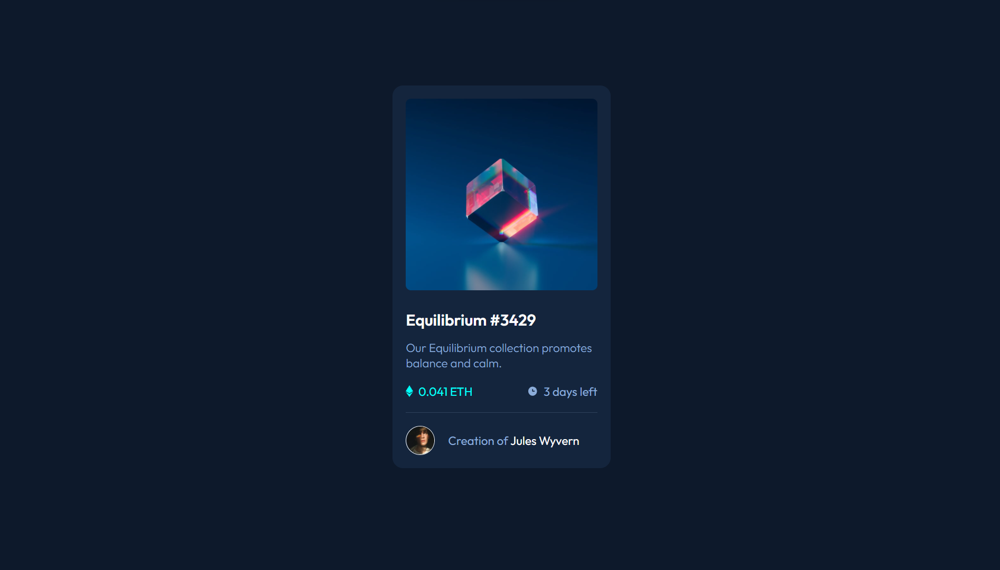

# Frontend Mentor - NFT preview card component solution

This is a solution to the [NFT preview card component challenge on Frontend Mentor](https://www.frontendmentor.io/challenges/nft-preview-card-component-SbdUL_w0U). Frontend Mentor challenges help you improve your coding skills by building realistic projects.

## Table of contents

- [Overview](#overview)
  - [The challenge](#the-challenge)
  - [Screenshot](#screenshot)
  - [Links](#links)
- [My process](#my-process)
  - [Built with](#built-with)
  - [What I learned](#what-i-learned)
  - [Continued development](#continued-development)
  - [Useful resources](#useful-resources)
- [Author](#author)
- [Acknowledgments](#acknowledgments)

## Overview

### The challenge

Users should be able to:

- View the optimal layout depending on their device's screen size
- See hover states for interactive elements

### Screenshot



### Links

- Solution URL: [GitHub Repository](https://github.com/ValeriaMontoya/nft-preview-card)
- Live Site URL: [Site URL on GitHub Pages](https://valeriamontoya.github.io/nft-preview-card/)

## My process

### Built with

- Semantic HTML5 markup
- CSS custom properties
- Flexbox
- Mobile-first workflow

### What I learned

With this project I was able to practice my HTML, CSS and Flexbox skills. I also put in practice CSS variables to avoid code repeating.

These are the variables I declared:

```css
:root {
  /* Colors */
  --primary-soft-blue: hsl(215, 51%, 70%);
  --primary-cyan: hsl(178, 100%, 50%);
  --main-bg: hsl(217, 54%, 11%);
  --card-bg: hsl(216, 50%, 16%);
  --line-color: hsl(215, 32%, 27%);
  --white: hsl(0, 0%, 100%);

  /* Typography */
  --body-font-family: "Outfit", sans-serif;
  --heading-font-size: 2.4rem;
  --paragraph-font-size: 1.8rem;
}
```

## Author

- Frontend Mentor - [@ValeriaMontoya](https://www.frontendmentor.io/profile/ValeriaMontoya)
- Twitter - [@vale_montoya\_](https://twitter.com/vale_montoya_)
